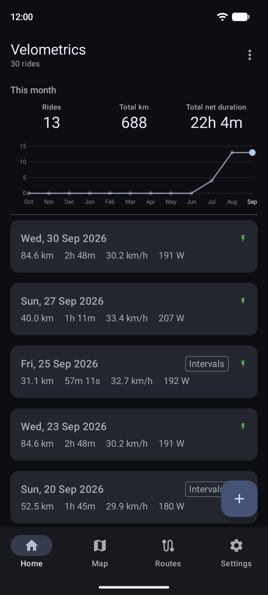
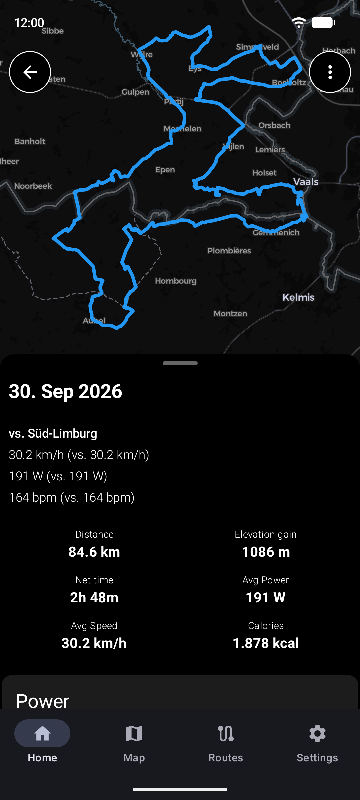
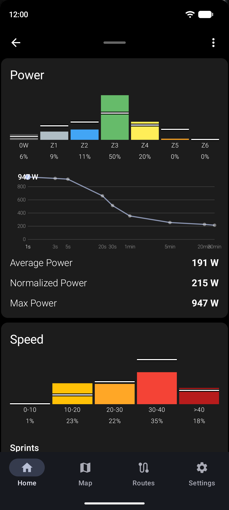
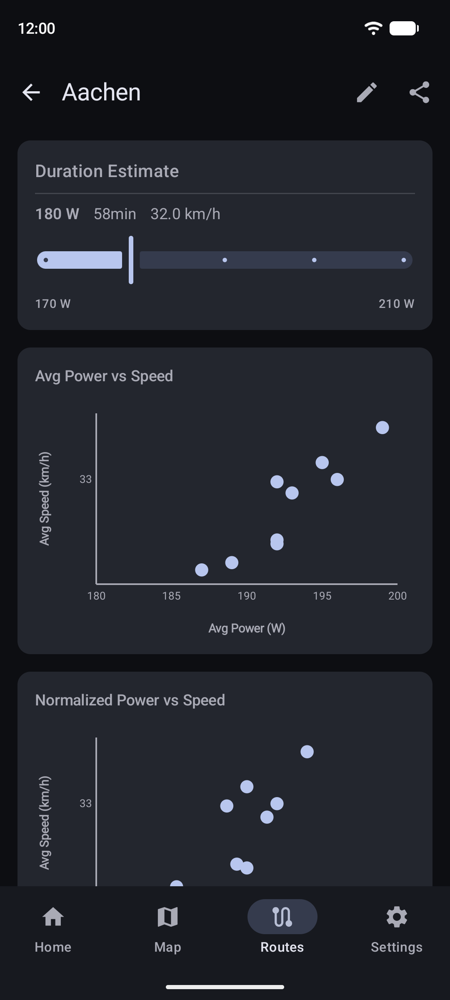
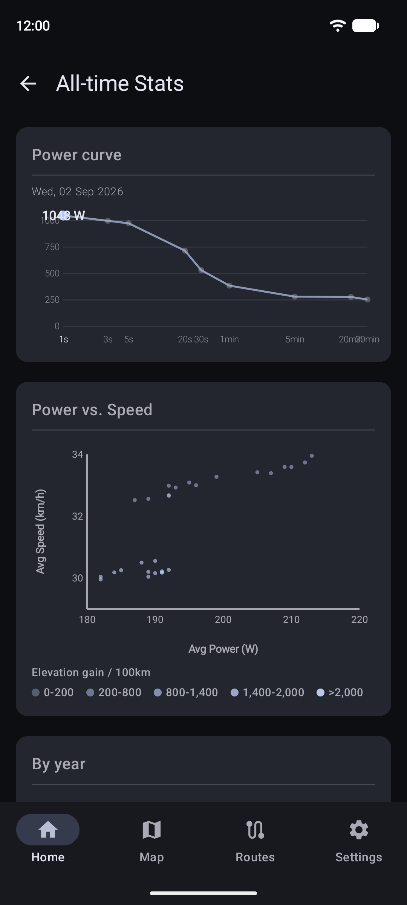

# Velometrics

What your rides say about you — power, pacing and progress from your .fit files.

<table>
  <tr>
    <td></td>
    <td></td>
    <td></td>
    <td></td>
    <td></td>
  </tr>
</table>

- **Import** rides from .fit files, or sync them automatically from Dropbox
- **Analyze** every ride: power and heart-rate zones, normalized power, intervals and sprints, cardiac drift
- **Fuel** estimate: calories and fat/carb split from your power
- **Repeated routes** are found automatically — compare every ride of the same loop
- **Repeated intervals** track the same climb or effort across rides
- **All-time stats**: power curve, power vs. speed, bests and distance splits
- **Training load**: fitness, fatigue and form from every ride
- **Map view** with intervals, flow segments and nearby POIs

Screenshots show 10 weeks of synthetic rides on four public komoot loops around Aachen;
map data © OpenStreetMap contributors, map style © CARTO. Regenerate with `./gradlew readmeScreenshots`
(needs a running emulator; wipes the app's data on it).

## Build

Android 14+ (API 34), Android Studio, JDK 11 (not 25). Clone, open, run.
The app bundles `velometrics.db` (~84 MB): the road graph and POIs for the Aachen region,
exported by Ride-Graph, a companion browser app (not yet public).

Built with Kotlin, Jetpack Compose, Room, Hilt, MapLibre and the Garmin FIT SDK.
Developed with Claude Code.
